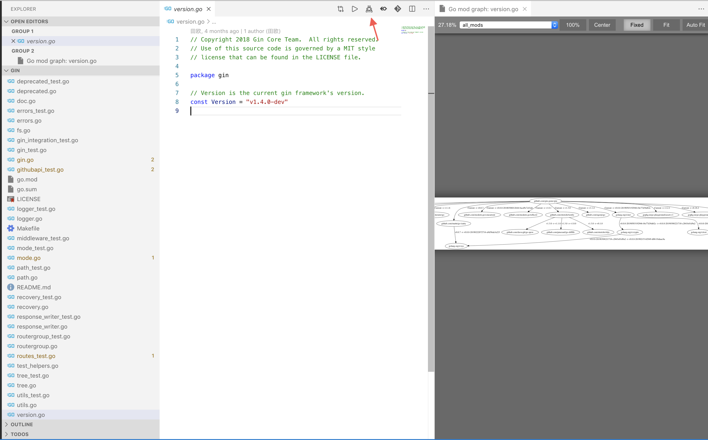
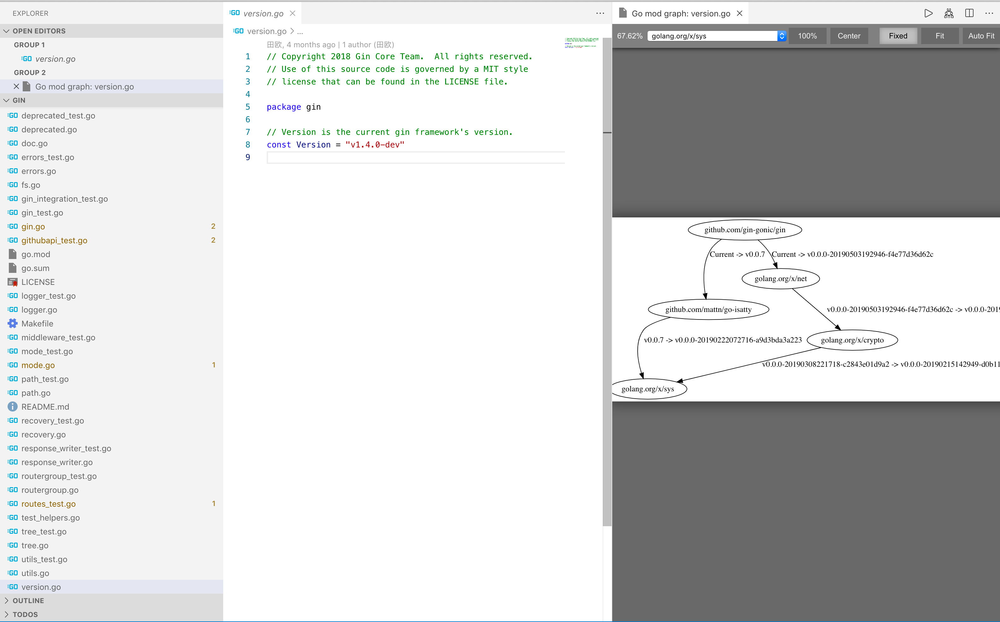

# Go Mod Grapher

An extension for Visual Studio Code to preview of go command: `go mod graph`.

## HELP
The author is not a front-end engineer. This extension should be considered as a prototype, so there will be many errors. Here is a known problem:

1. [NEED FIX] If the number of mods list on `go mod graph` is too much, (say, more than 30?) there will be suspended animation and do not work!
2. [TODO] Need proper progress message

## Pre install
1. Be sure that `go` command is in `$PATH`
2. Turn `Go Module` on
3. Install `graphviz` and make sure `dot` command is in `$PATH`
4. [OPTION] Make sure that `go mod graph` is functionally normal without some downloading process

## Installation

You can install this extension from the
[Visual Studio Marketplace](https://marketplace.visualstudio.com).

## Usage

### Open preview

1. Open the [Command Palette] then select “Graphviz: Open Preview to the Side”.
2. Click icon on the editor panel to trigger
### View type
1. Default view is the full view of `go mod graph`
2. Select one mod, it will show the view of this dependency.
It shows like `go mod why [mod]`

### Manipulate preview

| Action           | Gesture                                                                                                                                       |
| ---------------- | --------------------------------------------------------------------------------------------------------------------------------------------- |
| Zoom in          | Mouse wheel up / <kbd>+</kbd>                                                                                                                 |
| Zoom out         | Mouse wheel down / <kbd>-</kbd>                                                                                                               |
| Toggle 100% zoom | Mouse double click / <kbd>Space</kbd>                                                                                                         |
| Pan              | Mouse drag / <kbd>Left</kbd> / <kbd>Right</kbd> / <kbd>Up</kbd> / <kbd>Down</kbd> / <kbd>A</kbd> / <kbd>D</kbd> / <kbd>W</kbd> / <kbd>S</kbd> |
| Zoom to 100%     | <kbd>0</kbd>                                                                                                                                  |
| Move to center   | <kbd>X</kbd>                                                                                                                                  |

There are three zooming modes: **Fixed**, **Fit** and **Auto Fit**.

- **Fixed**: The zoom ratio does not change when the source changes or the window size changes.
- **Fit**: The graph is scaled to align to the border of the visible view area.
- **Auto Fit**: When the view area is big enough to contain a 100% sized graph, the graph will be set a zoom ratio of
  100%, otherwise the graph is scaled to fit into the view area.

### Export graph

To export the generated graph, click the “Export” button on the top right corner.

## Configuration

| Configuration             | Type               | Description                                                                                                                                   |
| ------------------------- | ------------------ | --------------------------------------------------------------------------------------------------------------------------------------------- |
| `graphvizPreview.dotPath` | `string` \| `null` | `null` means to use the “dot” program in your `PATH` environment variable, or a `string` value to indicate the “dot” program you want to use. |
| `graphvizPreview.engine`  | `"dot"` \| `null`  | The layout engine to use. `null` means to use the “dot” layout engine. Currently, only the “dot” engine is supported.                         |

Make sure the extension can find the “dot” program. You can set `graphvizPreview.dotPath` option to the path of the dot
executable, or make sure the directory containing the dot program is in your `PATH` environment variable.

To set the `graphvizPreview.dotPath` option, go to File → Preference → Settings.

## Known issues

- After saving an untitled file, the preview becomes invalid.
- When the zoom ratio is too large, the graph may be at a wrong position.
- Do not work if number of mods is too much.

## Acknowledgement
1. The base code is forked from [Graphviz-Preview](https://github.com/EFanZh/Graphviz-Preview), which is a extension to preview Graphviz (DOT) files
2. The code in screenshot is Golong web framework [gin-gonic/gin](https://github.com/gin-gonic/gin/)
3. The icon of this extension is download from [flaticon](https://www.flaticon.com/)
